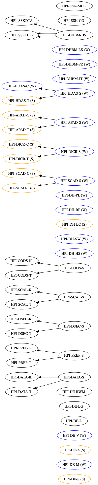

# HPI module catalogue dependency visualier

Some modules require you to take other modules in advance.
This repository contains a script to visualize those dependencies.
It can be used to plan the order in which you take your courses.

## How To

> Requirements: Node.js, Graphviz

Download the current module catalogue (must be in a similar format to [the one from 2018](https://www.uni-potsdam.de/am-up/2018/ambek-2018-04-146-193.pdf)).
Make a text file out of it using [pdf2text.online](https://pdf2text.online/) and save it to `result.txt`.
Execute the following command:

```
cat result.txt | node visualize.js | dot -T png > out.png
```

This will create `out.png`, which shows the dependency graph of all contained modules.
Hint: "B -> A" means that it's recommended to take module A before taking module B.

## Examples

